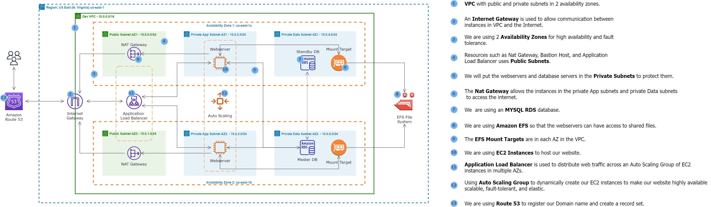
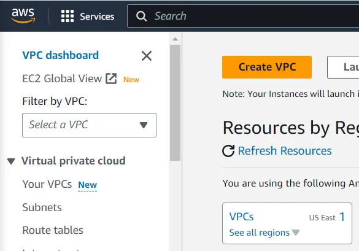

<h1>Deploy a WordPress Website on AWS</h1>

<h3>Introduction</h3>

I am glad to see you here again for our next real world project! We will learn how to deploy this dynamic website on AWS. We will also learn how to use my reference architecture to host this website using various AWS services and how they work together:

<ul>
<li>VPC with public and private subnets</li>
<li>Security groups</li>
<li>EC2 instances</li>
<li>NAT gateways</li>
<li>RDS</li>
<li>EC2 instance Endpoint connect - EICE</li>
<li>Application load balancer</li>
<li>Route 53</li>
<li>Auto scaling group</li>
<li>Certificate manager</li>
<li>EFS and more</li>
</ul>

<h3>Objectives</h3>
<ol>
<li>Build a three-tier AWS network VPC from scratch</li>
<li>Create NAT gateways</li>
<li>Create the security groups</li>
<li>Create the RDS instance</li>
<li>Create the elastic file system</li>
<li>Launch the setup server</li>
<li>SSH into an EC2 instance in the private subnet</li>
<li>Create an application load balancer</li>
<li>Register a new domain name in Route 53</li>
<li>Create a record set in route 53</li>
<li>Register for an SSL certificate in AWS certificate manager</li>
<li>Create an HTTPS listener for the application load balancer</li>
<li>Create an auto scaling group</li>
<li>Install WordPress theme and template</li>
<li>Clean up</li>
</ol>

We will start by creating a custom 3-tier VPC using the reference architecture above. In a 3-tier reference architecture, our infrastructure is divided into 3 tiers.

<strong>Tier 1</strong> — we have the public subnet which will hold the resources such as NAT gateway, load balancer, and bastion host

<strong>Tier 2</strong> — this is our private subnet which will hold our web servers (EC2 instances)

<strong>Tier 3</strong> — another private subnet which will hold our database

We will duplicate these subnets across multiple availability zones for high availability and fault tolerance.

Lastly, we will create an internet gateway and route table to allow the resources in our VPC to have access to the internet.

Let’s begin! 

<h3>VPC Architecture</h3>

<ol>
<li><strong>VPC</strong> with public and private subnets in 2 availability zones</li>
<li>An <strong>internet gateway</strong> is used to allow communication between instances in VPC and the internet</li>
<li>We are using <strong>2 availability zones</strong> for high availability and fault tolerance</li>
<li>Resources such as NAT gateway and application load balancer use public subnets.</li>
<li>We will put the web servers, EICE and database servers in the private subnets to protect them</li>
<li>The <strong>public route table</strong>  is associated with the public subnets and routes traffic to the internet through the internet gateway</li>
<li>The <strong>main route</strong> table is associated with the private subnets</li>
</ol>

<h2>Part 1: Build a Three-Tier AWS Network VPC from Scratch</h2>

<h3>VPC</h3>

In the management console, select the region where we want to create our VPC. According to our reference architecture we need to create this VPC in the N. Virginia region.

Either select VPC from the console or type VPC in the search bar above.

In your VPC dashboard select VPCs or the Create VPC orange box

